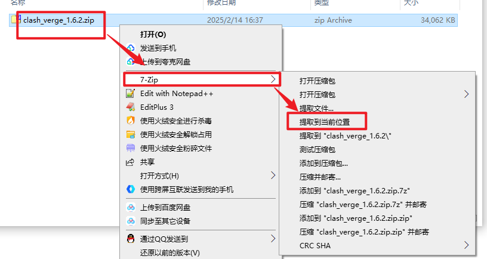
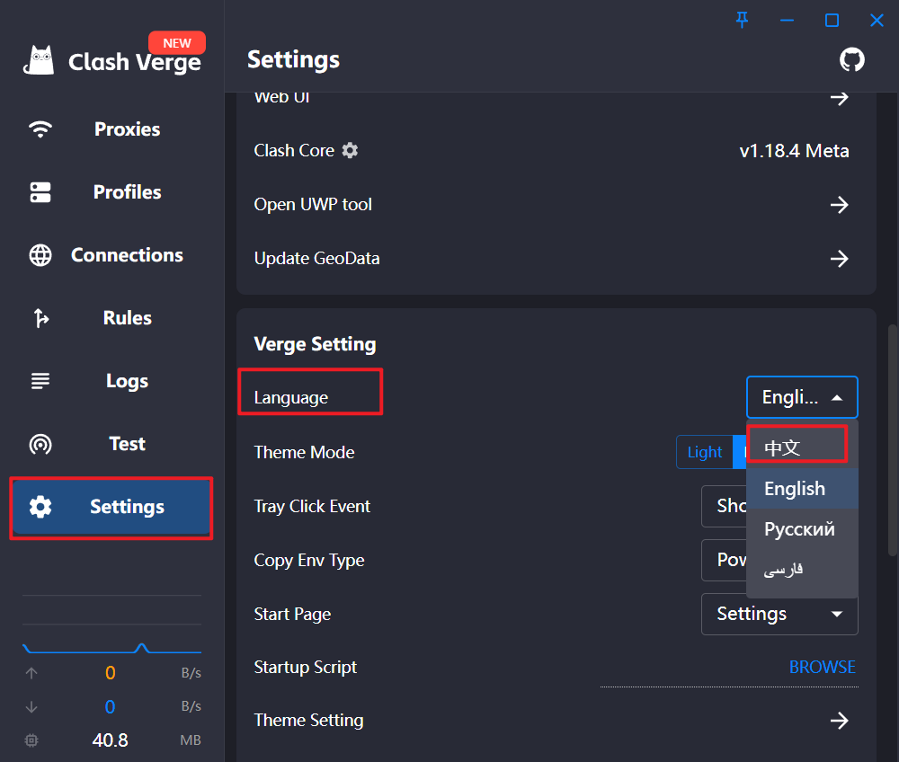
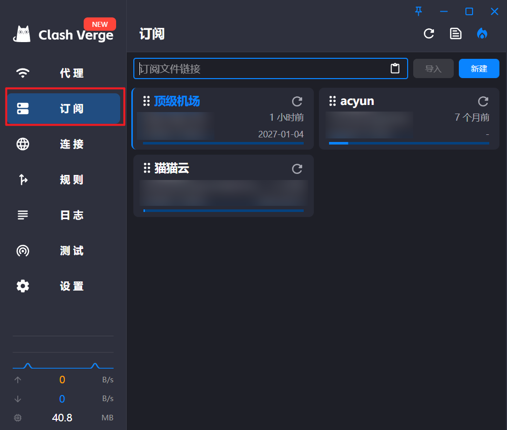
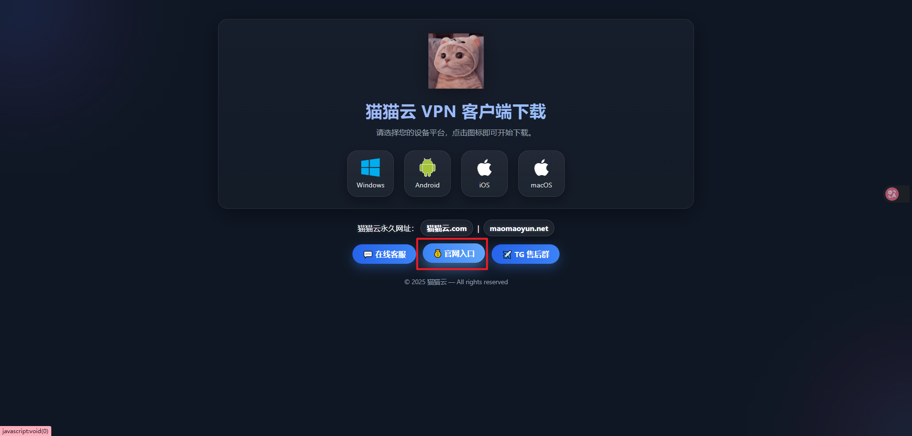
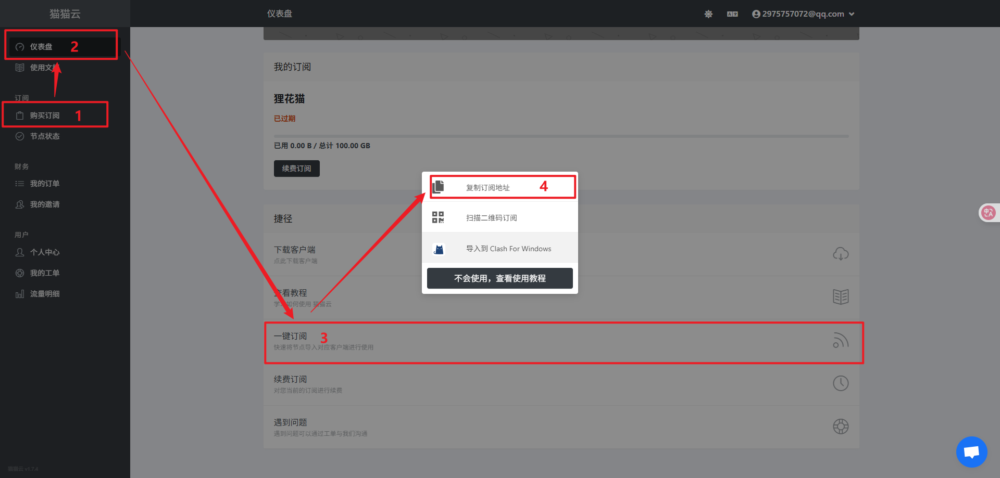
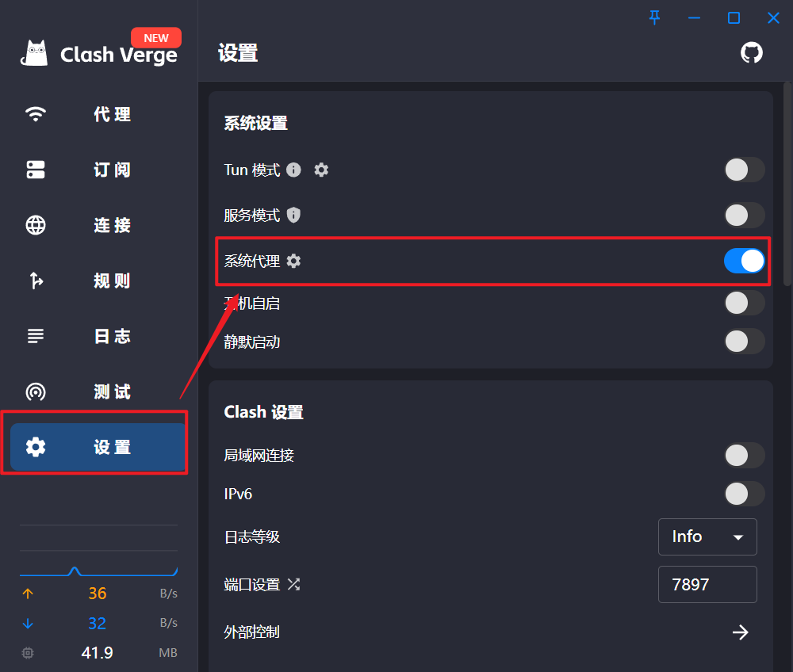

## Clash介绍

clash是一款强大的跨平台代理工具

基于规则的代理客户端，支持多种代理协议，通过灵活的规则匹配机制，实现对不同网站、应用流量的精细化控制。与传统“全局代理”不同，Clash 更强调“按需代理、精准分流”的理念，在提升访问效率的同时，也兼顾了稳定性与安全性。

Clash 项目最初发布于 GitHub，以开源形式维护，拥有活跃的开发者社区和大量用户基础。

## 使用教程

这里可以去GitHub下载,我也提供网盘下载链接,这里只说Windows和Android（安卓版本）的。

### Windows版本

#### 下载

直接点击下载

[clash.zip](https://share.feijipan.com/s/A2VoZ0gG)

#### 使用

下载完成之后单独创建一个文件夹, 然后解压这个文件

**注意：我这里使用的是7-zip，其他的解压软件右键之后列表应该也有解压的选项。**

因为这是纯净版本，解压完成后，需要手动添加桌面快捷方式。进去之后，找到文件名为`Clash Verge.exe`，右键，然后发送到桌面，这样下次就可以直接在桌面上打开。

注意：首次进入软件可能是全英文，这里点击setting往下找到language修改即可

软件本身只是提供代理服务，但是里面的订阅链接需要自行购买，购买方式我放到**推荐**中，我使用的有三个，如下。进入软件后来到订阅这里将订阅链接放到里面，然后点击导入即可

导入完成后，在来到设置，然后打开系统代理即可开始畅想GitHub，ChatGPT，Steam了。

---

### Android

#### 下载

点击即可下载

[clash.apk](https://share.feijipan.com/s/c2VoLAYy)

#### 使用

下载完成后进入主页，然后点击配置，之后右上角有个➕，点URL导入，把下面**推荐**中的购买的订阅链接放入，然后右上角有个保存的图标点击导入完成后即可回到主页点击打开就可以使用了。

---

### 推荐

接下来我放几个我个人比较推荐的网站。

1、猫猫云

这个是我经常用的一个网站，上网速度非常的快，而且不需要前提，最开始可以买一个这个进行后续操做。

**温馨提示，一般来说一个月的100G足够绝大多数人使用了，没必要买更多了**



进去后，点击中间这个

然后注册进入到主页面，先购买了自己的订阅之后来到仪表盘，找到一键订阅，复制下来

复制之后回到软件的这个位置粘贴进去然后导入

导入成功之后会有名字出来，然后打开系统代理就可以使用了。

---

2、顶级机场

这个是非常实惠的一个订阅网站，年费才15元，强烈推荐，但是这个网速不是很快，但是大多数场景足够使用，像是ChatGPT，这些完全够用。

***温馨提示**：这个网站需要已经订阅了然后才能进去，不然会加载得很慢，或者加载不进去，可以先尝试一下看看进不进得去，在决定要不要先买猫猫云，也就是上面那个然后再来这里买这个*



导入方法和上面的一样

---

3、acyun

这个是一个按流量收费的比较便宜的订阅，这个比较适合那种很久才用一次的人，这个我建议都买，能够防止月付年付过期了无法登录充值的问题。



导入方法也是一样。

---

其他的订阅我没用过，所以不做推荐，后续我发现了也会继续分享。

如果您使用的有推荐的也可以联系我：`2975757072@qq.com`

---

**免责声明**

本文所提及的网络工具、技术方案及相关内容，仅用于技术学习、网络原理研究与合法合规的信息获取之目的。作者不提供任何形式的网络代理服务，也不对第三方工具、软件或配置文件的可用性、安全性及合法性作出任何保证。

请读者在使用相关工具前，务必自行了解并严格遵守所在国家或地区的法律法规。任何因个人使用行为所产生的法律风险、经济损失或其他后果，均由使用者本人自行承担，与本文作者及本站无关。

本文不鼓励、不支持、不参与任何违法违规行为。若相关内容与您所在地法律法规存在冲突，请立即停止阅读并删除相关信息。

使用即视为已阅读并同意本免责声明。
