## C盘的重要性

 Windows 电脑中的C盘是非常重要的，他存放着：Windows 操作系统本体，系统更新文件，驱动程序，注册表、系统缓存，各类软件的运行环境，临时数据等等重要文件。

如果C盘爆满可能会导致电脑Windows 更新失败， 开机、关机明显变慢， 软件频繁卡死、无响应， 蓝屏、系统异常， 即使 D 盘还有很多空间，电脑依然很卡

> ***注意：清理C盘需要非常谨慎，请按照教程一步一步操做，不要误删系统文件！！***

## 教程开始

我提供的清理C盘的方式有很多种，大家可以根据需要跳转对应位置

[使用系统自带的「磁盘清理」](#001)

[修改文件位置](#002)

[手动清理系统临时文件（安全且有效）](#003)

[卸载不常使用的软件（重要）](#004)

[扩展C盘空间](#005)

### 使用系统自带的「磁盘清理」{#001}

这是最安全、最基础、效果也很明显的一步。

操作步骤：

打开【此电脑】，右键C 盘 → 属性

点击【磁盘清理】，等待扫描完成

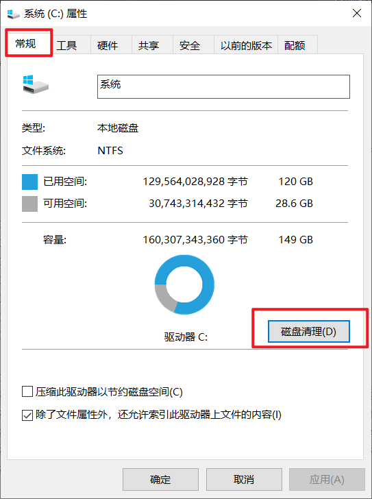

点击【清理系统文件】，再次扫描后，勾选以下项目：

- Windows 更新清理
- 临时 Windows 安装文件
- Windows 升级日志文件
- 设备驱动程序包
- 回收站
- 临时文件

如果你看到 “以前的 Windows 安装（Windows.old）”：

- 且你不需要回退系统
   👉强烈建议勾选（可能释放 10–30GB）

最后点击【确定】→【删除文件】

---

### 修改文件位置{#002}

通常来说,我们在浏览器上下载了文件会放到C盘的Downloads文件下，这个文件下可能会存有大量的文件，我们可以将这个文件中的内容移动到其他盘中，不占用C盘资源。

> **注意：如果此操作完成后你的电脑出现异常，请找到移动操做旁边的恢复默认，然后应用即可**

操作步骤：

打开【此电脑】，右键Downloads → 属性

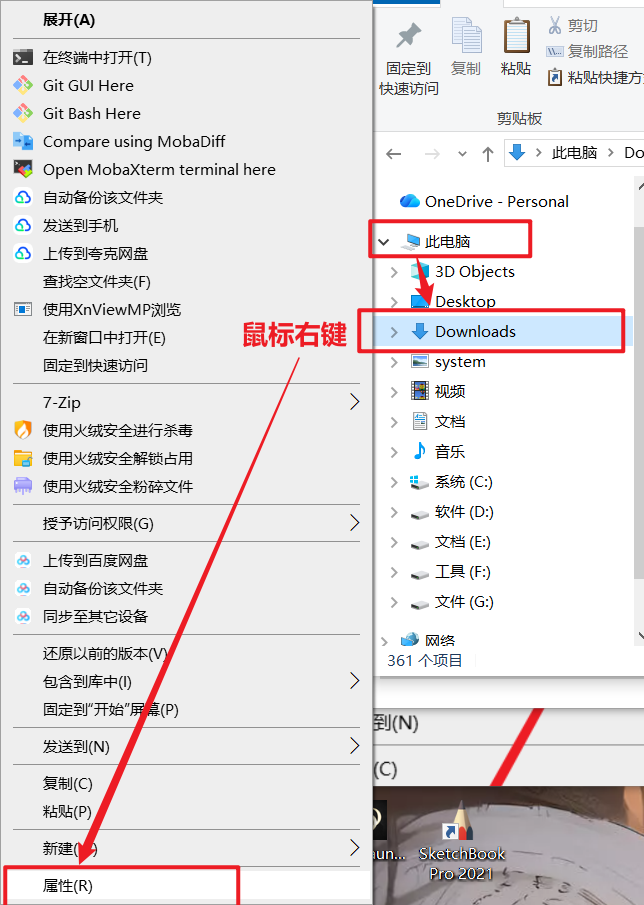

点击 位置 -> 移动

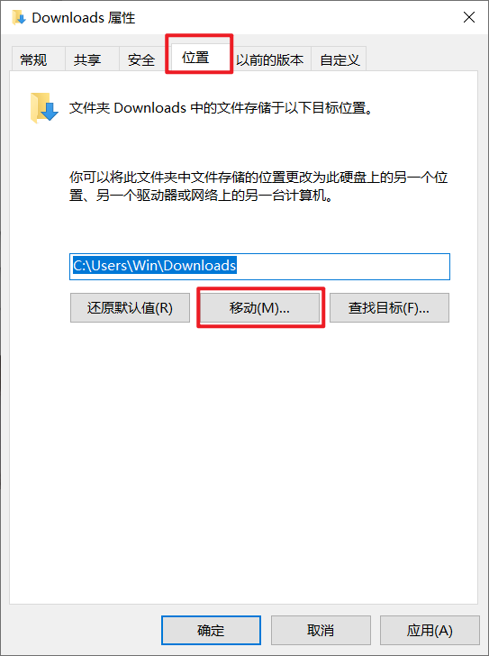

> 建议移动到远离C盘的位置，例如：如果有C盘、D盘、E盘，就移动到E盘。

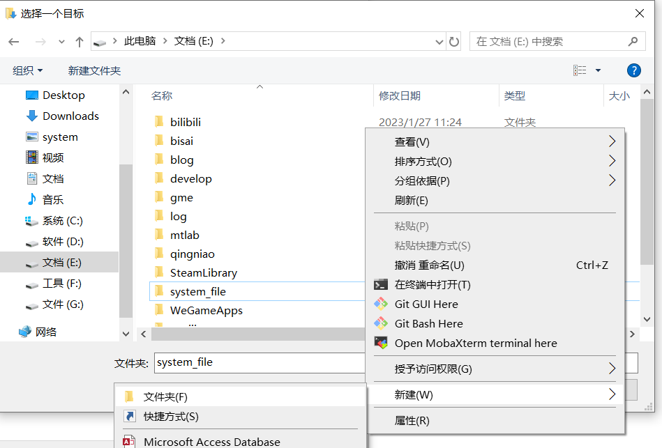

在E盘下建立一个system_file文件夹，（如果只有D盘就在D盘下建system_file文件夹），然后点击选择文件夹，之后点击应用，就开始移动了，移动过程中不要打断。

同理这几个也可以进行移动。

>注意：Desktop不要移动，这是系统电脑桌面，移动后容易出现问题

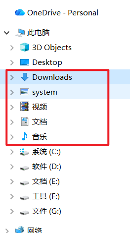

---

### 手动清理系统临时文件（安全且有效）{#003}

清理用户临时文件：

在键盘上按下 win+R，来到下面这个界面

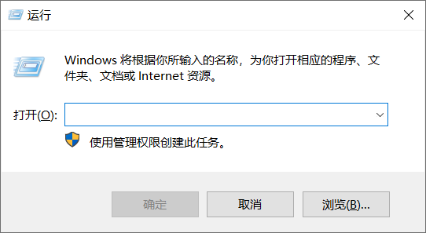

输入`%temp%`

然后回车

删除这个目录中的所有文件（删除不了的文件跳过即可）

---

清理系统临时文件：

再次 `Win + R`

输入：`temp`

同样全选删除

---

清理 Windows 临时目录：

打开以下路径：

`C:\Windows\Temp`

 删除里面所有文件（需要管理员权限）

---

### 卸载不常使用的软件（重要）{#004}

这一步需要做的事情有：清理卸载软件的残留，清理桌面。

卸载软件不是把桌面上的图标删除就完了，这只是删除了快捷方式，推荐一个卸载工具（Geek）给大家，这样可以检查一下，之前删除的软件是不是只删除了快捷方式，如果在Geek中发现你之前删除的软件还在，大概率是只删除了快捷方式，这时候只需要在Geek中右键对应软件，然后卸载即可。

软件下载方式在下面的文章中有，点击即可跳转：

Geek使用教程

清理桌面：

桌面上的文件其实也是占用的C盘的空间，如果桌面上的文件太多，没有清理，也会占用大量的C盘空间，所以大家尽量把桌面上的大文件清理掉，这样也能为C盘提供空间。

桌面上的文件删除就是删除后，到回收站里直接清空回收站就删除了。

**注意：清空回收站后的文件就无法找回了，所以请确保回收站中没有重要文件，以免造成重要文件丢失。**

---

### 扩展C盘空间{#005}

> 如果你需要帮助,可联系作者`2975757072@qq.com`

这个操做是扩展C盘空间，需要有一个前提条件：就是D盘的空间足够大，将D盘的多余空间分给C使用，这里要用到一个工具（diskGenius），下载链接也一同奉上。

首先找到键盘上的win+R

输入`diskmgmt.msc`

找到D盘，鼠标右键，压缩卷

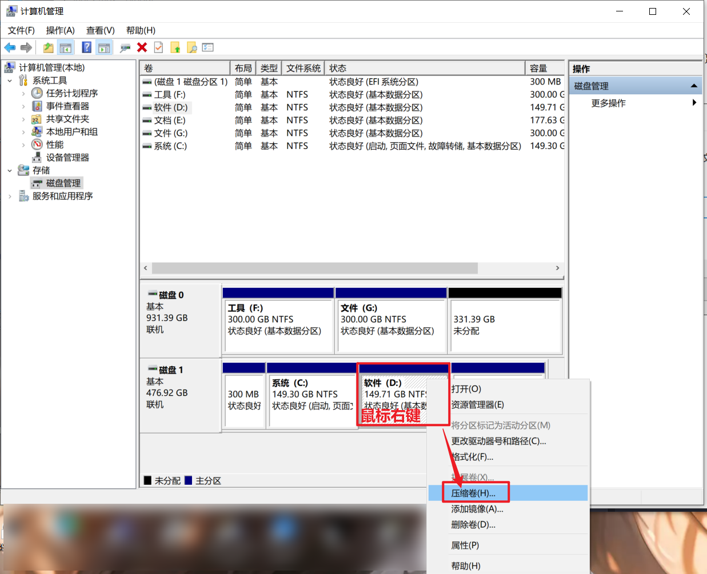

输入需要压缩的空间大小，**这里注意不要直接点压缩，否则D盘的所有空间都会被压缩，请给D盘也预留至少10G的空间**，输入完成后点击压缩即可。

完成之后下载软件diskGenius：

diskGenius下载链接

下载之后进入界面是这个样子的，箭头所指就是压缩到C盘的空间，这部分要移动到C盘和D盘中间，这样C盘才能完成扩容。

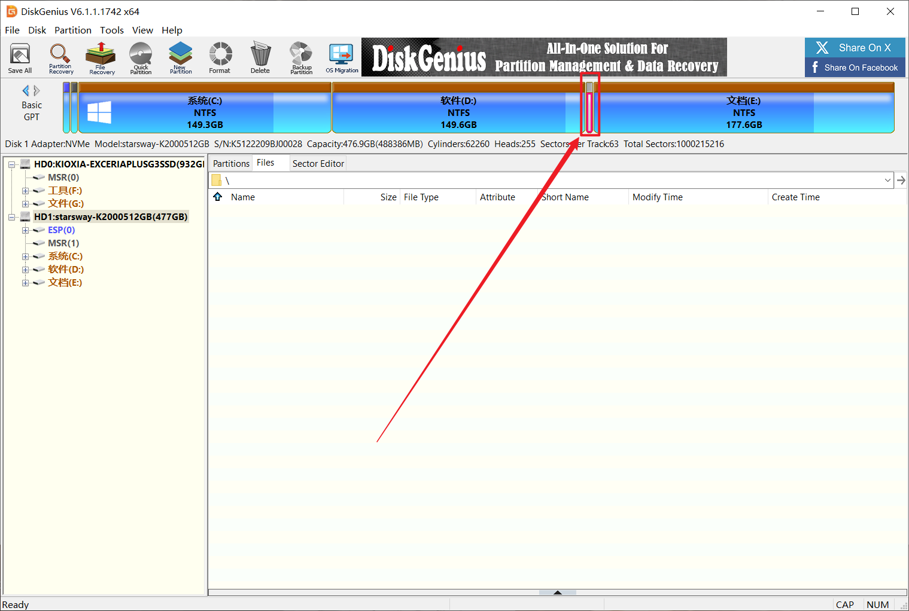

点击一下D盘，找到菜单栏中的Partition，点击Resize Partition进入移动界面。

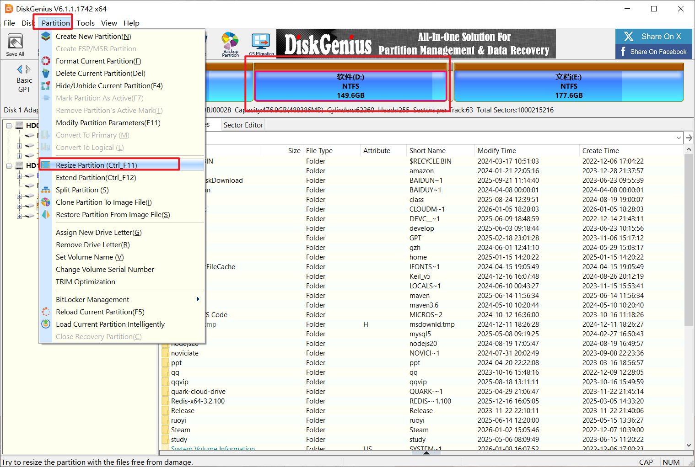

---

虽然 DiskGenius 支持无损操作，但：

> **任何涉及分区调整的操作，都存在极低概率风险**

建议至少备份：

- D 盘重要文件
- C 盘重要文档

**进行该操做会关闭正在运行的软件，如果你的文档或者其他文件没有保存记得先保存**

特别是：

- 杀毒软件
- 虚拟机
- 下载工具

---

进来后找到上面的长条按住鼠标左键不松手，然后往右拖动，拖到最右边即可，判断方法是下面的Space of Rear paet这个框中数值为0则操做完成，最后点击start开始移动，会跳出两个框，点击yes即可。等待一段时间后会出现按钮`complete`点击就完成移动步骤。

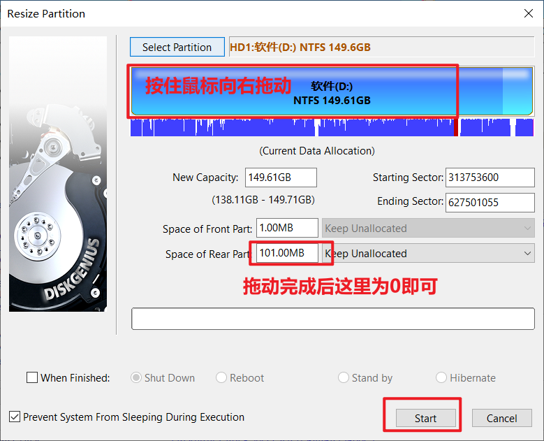

完成之后再次同时按下键盘上的`Win+R`

输入`diskmgmt.msc`

此时的界面是这样的，有未分配空间在C盘和D盘中间

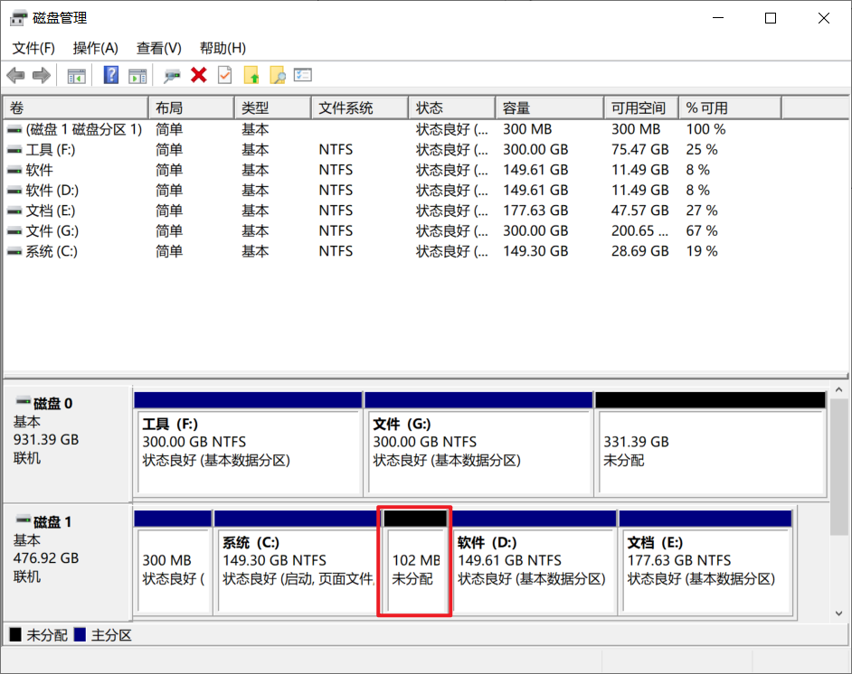

最后，选中C盘然后鼠标右键，选择扩展卷

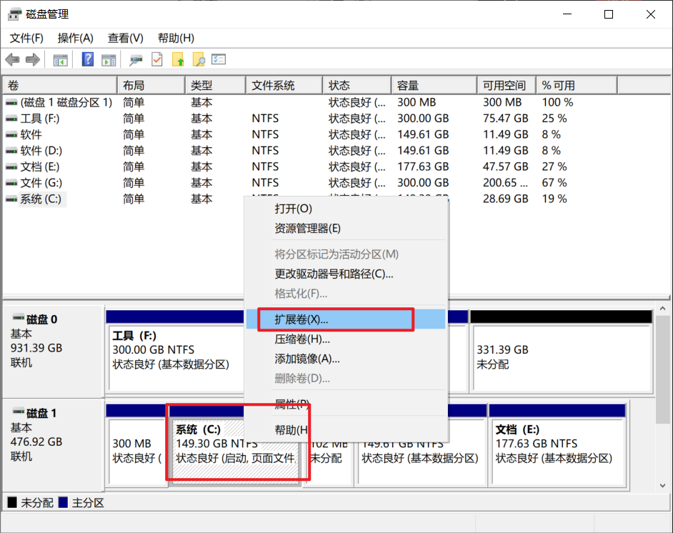

一直点击下一步即可完成扩展操做

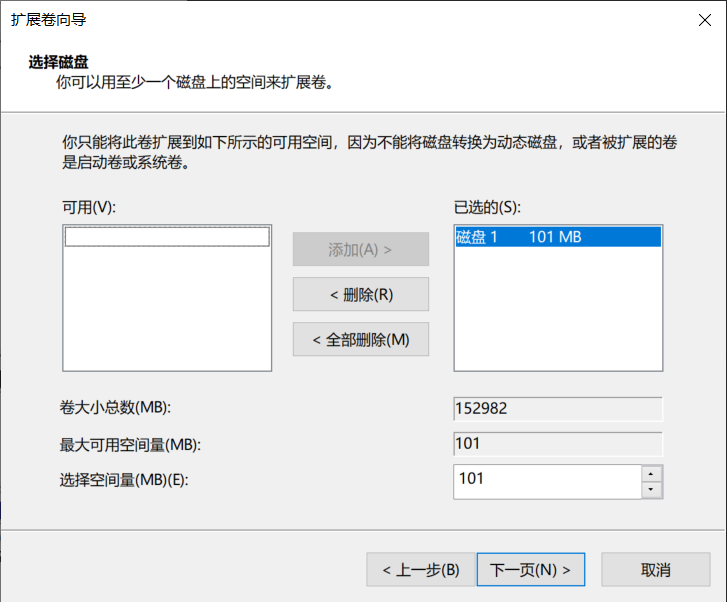

完成扩展后,你的C盘将多出来很多空间，建议重启一下电脑，然后在进行其他操做。

### 写在最后的建议

清理 C 盘不是一次性的工作，更重要的是正确的使用习惯：

- 新软件尽量安装到非 C 盘
- 定期清理下载目录
- 不把桌面当仓库

---

教学到此结束，如有其他问题，可联系作者：`2975757072@qq.com`
