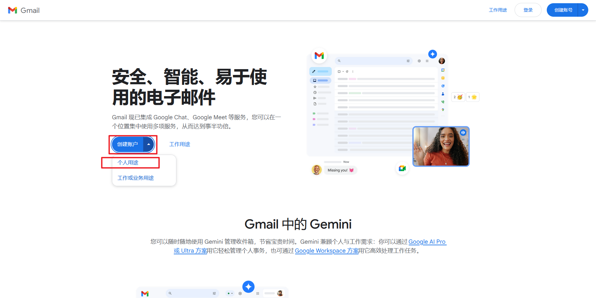

## 谷歌邮箱（Gmail）介绍

谷歌邮箱（Gmail）是目前全球使用最广泛的邮箱服务之一，不仅稳定、安全，而且在学习、外贸、科研、跨境电商、开发者工具等场景中几乎是“刚需”。

但很多人在注册时经常遇到：

- 页面打不开
- 手机号无法验证
- 验证码收不到
- 注册流程中断

本文将从零开始，手把手教你一次完成注册，并附上常见问题与解决方法。

## 一、注册前需要准备什么？

在开始之前，请先确认你已经准备好以下条件：

###  1. 稳定的网络环境

- 确保可以正常访问 Google 相关页面，建议使用Clash

如果这一步不会的话,可以访问我的另一篇文章 

Clash教程

- 网络尽量稳定，避免中途切换节点

> ⚠️ 注册过程中频繁切换网络，容易触发风控。

###  2. 一个可用的手机号

- 国内手机号通常可以使用
- 用于接收短信验证码
- 建议使用本人常用手机号

## 二、谷歌邮箱注册入口在哪里？

在浏览器中打开 Gmail 官方注册页面后，点击 **“创建账号”**，选择：

[注册链接](https://workspace.google.com/intl/zh-CN/gmail/)

- **为自己创建**（个人使用）
- 或 **为工作 / 学习创建**（根据需求）

进入正式注册流程。

------

## 三、详细注册步骤（图文思路版）

### 第一步：填写基本信息

按提示填写：

- 姓名（可使用拼音或英文名）
- 出生日期及性别（按照个人信息填写即可）
- 邮箱名（这里的邮箱名很重要，不要随便设置，因为后期如果邮箱密码忘记了需要填写邮箱的全名才能找回）
- 密码（建议 8 位以上，包含字母和数字）

📌 提示：

- 用户名如果已被占用，系统会提示你更换
- 可以尝试：名字 + 数字组合

### 第二步：手机号验证

输入手机号后：

1. 点击“下一步”
2. 等待接收短信验证码
3. 填写验证码完成验证

⚠️ 注意事项：

- 验证码通常 1–2 分钟内到达
- 如果多次失败，请稍等一段时间再试

------

### 第三步：隐私与条款确认

仔细阅读后：

- 勾选同意相关条款
- 点击 **“创建账号”**

至此，谷歌邮箱账号注册完成 🎉

---

如有问题可通过邮箱联系我：`2975757072@qq.com`
