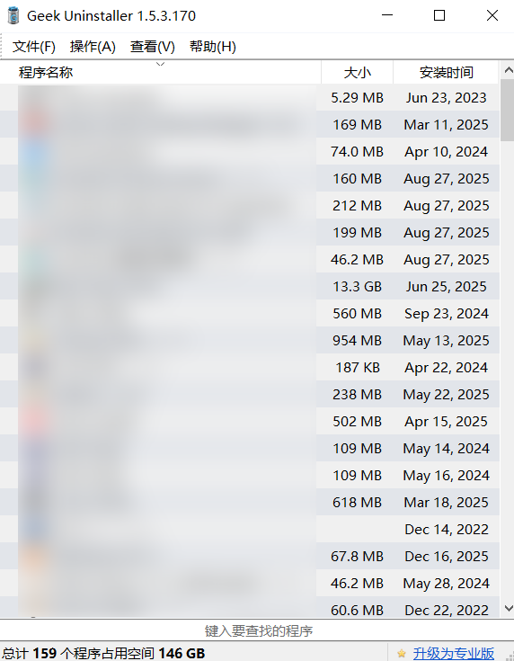

## Geek介绍

电脑上的软件卸载对于很多电脑小白来说算是一件比较困难的事了，而且很多软件下载了之后会修改注册表什么的，卸载的不干净就会留下很多垃圾，慢慢的电脑内存就会比较紧张，C盘爆满也是常事，今天我介绍的这款软件是我使用过的非常推荐的一款电脑端卸载软件，下载方式在文末。

另外，如果你的C盘爆满，也可以看看我另一个文章

C盘清理教程

## 使用

下载完成后可直接使用，这款软件不用安装，所以不会自动创建快捷方式，创建快捷方式的办法如下：

找到你下载软件的文件夹，右键->发送到->桌面(Desktop)

Geek的使用界面非常的简洁，进去软件后会有一个软件的列表，如果需要卸载，鼠标右键然后点击卸载即可。

> ***注意：千万不要为了尝试卸载用鼠标左键双击，不然有些软件直接就卸载了，非常危险。***

## 下载

下载方式:点击下面的链接即可下载

[点击下载geek](https://share.feijipan.com/s/rdVsQq0H)

---

如下载链接有问题,联系我:`2975757072@qq.com`
