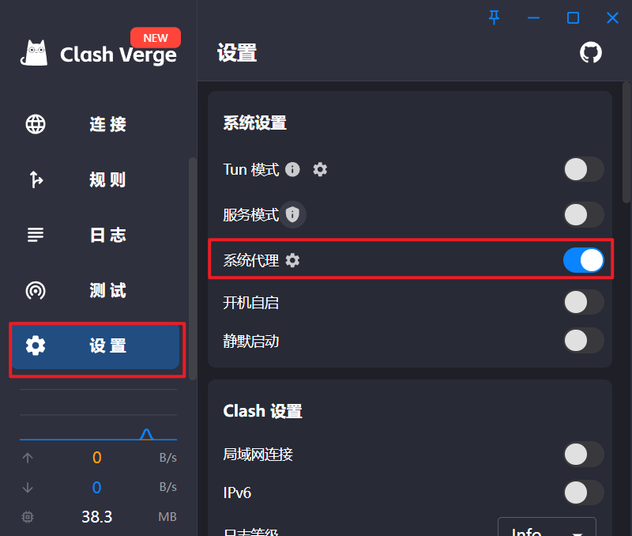
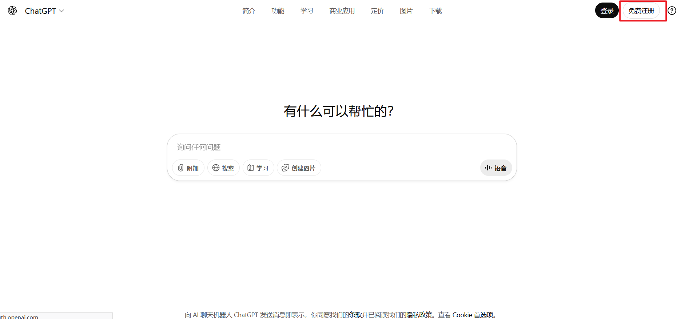
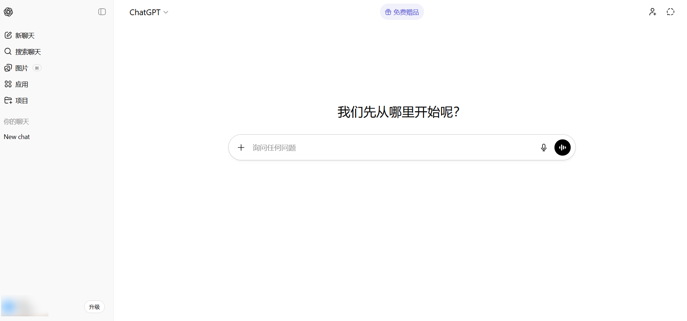

## 介绍ChatGPT

在AI时代，各种各样的AI席卷而来，今天我将介绍的是一个重量级的AI产品ChatGPT，ChatGPT是我本人经常使用的一个AI工具，不论是写代码，做作业都是非常的好用，我也用过其他的AI比如：deepseek，豆包，通义千问等等，但是我用下来经常是答非所问，很难使用。今天我就介绍一下如何使用ChatGPT。

如果从零注册的话会稍微的有些麻烦，但是我会将每个步骤都讲清楚的，如需帮助也可以通过邮箱联系我，当然，如果你觉得麻烦，也可以联系博主代注册也可以。

### 准备

在注册ChatGPT之前需要准备一些东西（每一个都可以对应一篇文章查看）

1. clash（必备）

​	懂的都懂

Clash教程

2. Google邮箱（可选）

​	这个主要是注册GPT账号可以用来快捷登录，现在GPT是支持邮箱登录，我试了一下，现在直接使用QQ邮箱也是可以注册成功的，当然如果注册一个Google邮箱的话也是我比较推荐的，因为很多的网站都支持使用Google快速登陆的。

[Google邮箱注册](https://mail.google.com/)

3. sms账号（这是以前注册登录ChatGPT必须的,现在GPT官方删除了这个步骤，所以请忽略这段。）

​	这是一个卡号租赁的平台，需要花一些钱，花费不固定，不过一般几块钱就可以搞定。***注：本人不收取任何费用，你可以自行寻找一些租赁号码的平台使用***。

GPT在进去使用时需要用一个手机号来验证一下，国内的手机号不支持，所以需要租赁一个号码使用，不用担心后面找不到号码什么的，我使用GPT已经2年多了，也没出什么问题。

[SMS](https://hero-sms.com/)

## 教程开始

首先先打开clash，来到设置中，打开系统代理

然后进入ChatGPT官网

[GPT官网](https://chatgpt.com/)

进去之后选择一种登录方式即可，登录完成后来到这个界面就可以使用啦

