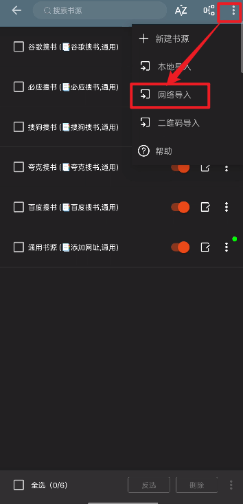

## 软件介绍

​	阅读Pro 是一款专注于电子书阅读体验的多功能阅读软件，支持多种主流电子书格式，界面简洁克制，功能却十分全面，最重要的是，我们把书籍下载导入之后，没有网络的情况下也能使用。无论是小说、技术书籍，还是学习资料，它都能提供稳定、流畅且高度可定制的阅读体验，适合长期深度阅读用户使用。

​	我在小说清单中分享的书籍格式都是epub的,导入到阅读Pro中,会有非常丝滑的使用体验，下载方式在文章末尾自取。

## 核心功能亮点

### 1. 多格式电子书支持

阅读Pro 支持多种常见电子书格式，如 TXT、EPUB、PDF 等，能够满足不同来源书籍的阅读需求，免去了频繁转换格式的麻烦。

### 2. 极致简洁的阅读界面

软件整体设计风格偏向极简，没有多余广告和干扰元素。阅读界面干净清爽，让用户能够真正沉浸在文字内容中，而不是被功能按钮或弹窗打断阅读节奏。

### 3. 高度可定制的阅读体验

阅读Pro 提供丰富的个性化设置选项，包括：

- 字体大小与行距调整
- 多种背景与主题模式（护眼模式、夜间模式等）
- 翻页动画与阅读方向设置

用户可以根据自己的阅读习惯，打造最舒适的阅读环境。

### 4. 阅读进度与书签管理

软件支持自动记录阅读进度，随时断点续读；同时提供书签与章节快速定位功能，方便在长篇内容中快速跳转和查阅重点。

### 5. 离线阅读支持

导入书籍后即可离线阅读，不受网络环境影响，特别适合通勤、旅行或网络不稳定的场景。

## 使用方法

### ①导入书源

阅读pro有好几种使用方式,第一种是通过导入外部链接资源,然后就可以通过搜索网络资源,这种方式需要导入外部链接,而且资源可能有时会失效,操做方法:

安装好之后按照截图操做



1、墨辰整理书源大全7.0

`https://shuyuan-api.yiove.com/redirect/shuyuan/20260103030402.json`

2、1990个书源

`https://gcore.jsdelivr.net/gh/yuedu520/yuedu/251102.json`

3、16724个书源

`https://shuyuan-api.yiove.com/redirect/shuyuan/20250813120526.json`

4、🍅番茄系列综合书源

`https://shuyuan-api.yiove.com/redirect/shuyuan/20250120201434.json`

5、星云2600书源

`https://list.yiove.com/d/OpenFiles/ShuYuan/%E6%98%9F%E4%BA%912600%E4%B9%A6%E6%BA%90.json`

6、ZGQ-inc 整理书源

`https://github.com/ZGQ-inc/source/releases/download/23041/bookSource_23041.json`



​	将书源地址复制后导入,然后回到主页直接搜索即可搜索到自己想要的书籍,动漫等等资源

### ②导入本地书籍(下载本站书籍就用这个办法)

​	首先把书下载到本地，然后点一下这个文件，会自动弹出打开方式，这时候使用阅读Pro打开就可以了。

​	只要成功打开一次之后，阅读pro上就会自动保存下来，下次想看可以直接打开阅读Pro即可阅读。

---

​	如果上面的方法不能打开的情况，在本地找到书籍，长按之后点击使用其他方式打开，然后选择阅读Pro即可。

## 软件下载方式

阅读pro 软件下载方式:	点击下方链接下载:

阅读Pro下载链接

---

链接失效请通过邮箱联系作者:  

`2975757072@qq.com`

-----

免责声明

1. **网站内容**
   本网站提供的书籍内容均来自互联网的公开资源，仅供个人学习、交流和研究使用。本网站不存储任何书籍资源文件，所有内容均由用户通过第三方链接获取。本网站不对任何内容的合法性、准确性、真实性、有效性承担责任。
2. **版权声明**
   本网站所提供的内容版权均归原作者或出版社所有，本站不拥有任何内容的版权。若因内容涉及到版权问题，请相关版权方及时联系我们，我们将在核实后尽快删除相关内容。
3. **用户责任**
   用户在使用本网站时，应遵守相关法律法规，不得将本网站提供的资源用于商业用途。因用户行为违反法律法规或侵犯他人合法权益所产生的责任，由用户自行承担。
4. **免责条款**
   对于因不可抗力或本站无法控制的原因（包括但不限于黑客攻击、系统故障、网络中断等）导致的服务中断或用户信息丢失、泄露等，本网站不承担任何责任。
5. **外部链接**
   本网站可能包含第三方网站的链接，这些链接仅为方便用户而提供，并不表示我们对其内容的认可。本网站对任何第三方网站的内容或其隐私政策不承担责任。
6. **修改与解释权**
   本声明未涉及的问题参照国家有关法律法规执行，当本声明与国家法律法规冲突时，以国家法律法规为准。本网站保留对本免责声明的修改和最终解释权。
